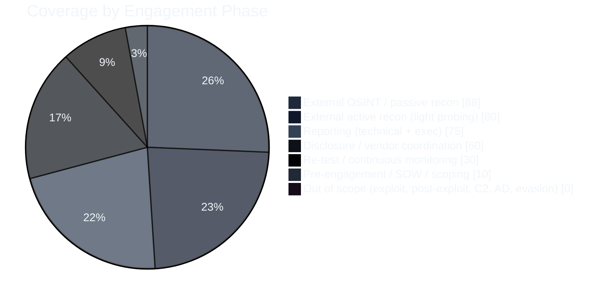
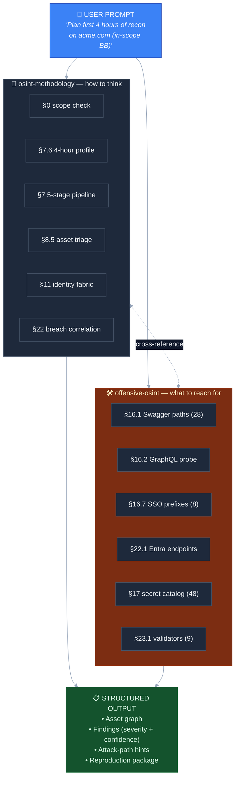
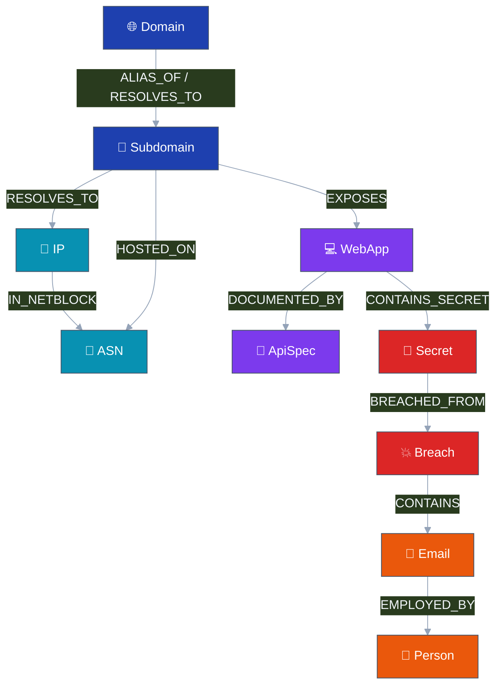
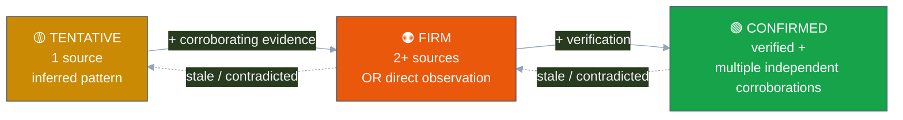
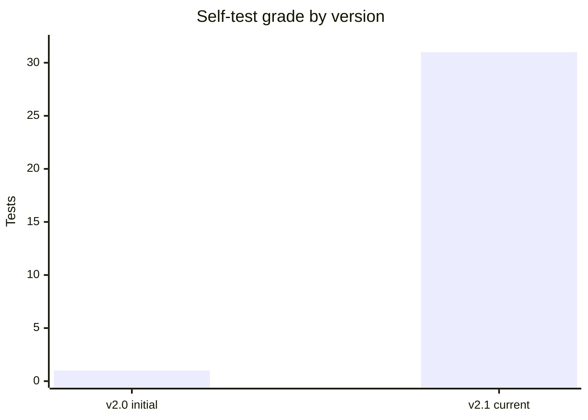
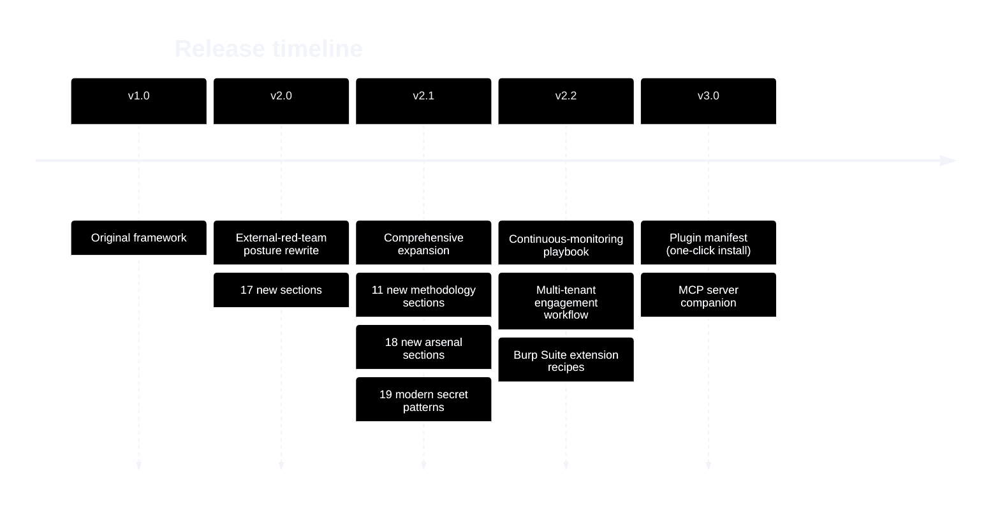

<div align="center">

# 🦅 Claude-OSINT

### Two production-ready Claude skills for external red-team OSINT and bug-bounty reconnaissance

**Methodology + arsenal, paired.**
~5,500 lines of structured OSINT tradecraft · 96.9% PASS on 32-prompt self-eval · ~85–90% practitioner coverage for the recon phase of authorized engagements.

[](LICENSE)
[](CHANGELOG.md)
[](#-what-you-get)
[](#-coverage)
[](tests/smoke-test-prompts.md)
[](CONTRIBUTING.md)
[](https://github.com/elementalsouls/Claude-OSINT/commits/main)
[](https://github.com/elementalsouls/Claude-OSINT/stargazers)

[Quick Start](#-quick-start) · [What's in the box](#-whats-in-the-box) · [Coverage](#-coverage) · [Examples](#-examples) · [Architecture](docs/architecture.md) · [Contributing](CONTRIBUTING.md)

</div>

---

## 📚 Table of Contents

- [What you get](#-what-you-get)
- [Quick start](#-quick-start)
- [Coverage](#-coverage)
- [What's in the box](#-whats-in-the-box)
- [How they work together](#-how-they-work-together)
- [The asset graph](#-the-asset-graph)
- [Confidence pipeline](#-confidence-pipeline)
- [Examples](#-examples)
- [Self-test](#-self-test)
- [Authorization & legal](#-authorization--legal)
- [Architecture & design philosophy](#-architecture--design-philosophy)
- [Project status & roadmap](#-project-status--roadmap)
- [Contributing](#-contributing)
- [Acknowledgments](#-acknowledgments)
- [License](#-license)

---

## 🎁 What you get

Two complementary [Claude skills](https://docs.claude.com/en/docs/claude-code/skills) for offensive OSINT:

| Skill | Role | Lines | Sections | Triggers when... |
|---|---|---|---|---|
| **[`osint-methodology`](skills/osint-methodology/)** | The "how to think" reference | ~1,700 | 33 top-level | Planning recon, asset-graph thinking, severity rubric, identity-fabric methodology, deliverable templates |
| **[`offensive-osint`](skills/offensive-osint/)** | The "what to reach for" arsenal | ~3,800 | 51 top-level | Concrete probe paths, regexes, payloads, scoring rules, curl one-liners, tool URLs |

Most prompts pull both — they're complementary, not overlapping.

---

## 🚀 Quick start

### Option A: Use with Claude Code

```bash
git clone https://github.com/elementalsouls/Claude-OSINT.git
cd Claude-OSINT

# Populate the full SKILL.md content (one-time, after clone)
./scripts/sync-skill-content.sh

# Install both skills as a Claude Code plugin
# (assumes you have Claude Code installed — see https://docs.claude.com/en/docs/claude-code)
cp -r skills/* ~/.claude/skills/
```

Then in any Claude Code session, just ask an OSINT question. The skills auto-trigger on relevant phrases.

### Option B: Use with Claude.ai / Claude API

1. Open Claude.ai (Pro/Team/Enterprise plans) or your Claude API integration.
2. Create a Project (Claude.ai) or System Prompt (API).
3. Attach both `SKILL.md` files as project knowledge.
4. Start asking OSINT questions.

### Option C: Use as a reference document

Both `SKILL.md` files are readable Markdown. Open them in any editor and use as a personal OSINT cheat-sheet — no Claude required.

---

## 📊 Coverage

These skills are scoped to **external OSINT-driven reconnaissance for authorized engagements**. Honest coverage assessment by red-team archetype:

| Practitioner | Coverage of their needs |
|---|---|
| Pure OSINT analyst | **~90%** |
| External attack-surface analyst (CyCognito-style) | **~85–90%** |
| Bug bounty hunter | **~75–80%** |
| Threat intel investigator | **~70%** |
| External red teamer (recon phase) | **~85–90%** |
| External red teamer (full engagement, recon-to-report) | **~35–45%** ⚠️ |
| Internal red teamer | ~10% (most out of scope) |

⚠️ **Out of scope:** active exploitation, post-exploitation, lateral movement, AD attacks, C2 frameworks, AV/EDR evasion, malware development, payload crafting. These require separate skills.

See [`docs/coverage.md`](docs/coverage.md) for the full coverage breakdown.



---

## 📦 What's in the box

### `osint-methodology` (the "how to think")

| § | Capability |
|---|---|
| 0–5 | When-to-use, authorization, confidence levels, output format, source hygiene, hard rules |
| 6 | OpSec (sock puppets, **detectability tagging**, validator discipline, **detection-aware probing + back-off ladder**) |
| 7 | **5-stage recon pipeline** + priority order + **time budgeting / engagement profiles** (1-hour / 4-hour / 1-day / 1-week) |
| 8 | **Asset graph discipline** (29 asset types, 23 typed edges, **per-asset-type triage rules**) |
| 9 | **Findings rubric** with examples per severity tier + escalation rules |
| 10 | Bug-bounty / red-team pivot modes + **scale-based tactics** (small/medium/large/conglomerate) |
| 11 | **Identity fabric mapping** (Entra, Okta, ADFS, Google, SAML, AWS, **M365 deep**) |
| 12 | API & auth-map methodology (discovery → classification → interest score) |
| 13 | JavaScript deep analysis (sourcemaps, secrets, endpoints, internal-host leakage) |
| 14 | Mobile attack surface (Android + iOS + Firebase) |
| 15 | Cloud attack surface (S3/GCS/Azure permutations) |
| 16–19 | Cryptocurrency, image, video, chronolocation |
| 20 | Threat actor investigation (incl. **RU/CN-specific pivots**) |
| 21–25 | People & social media, **breach × identity correlation**, infrastructure OSINT, automation, synthetic media |
| 26 | Anti-patterns & common failure modes |
| 27 | **WAF / CDN bypass & origin discovery** |
| 28 | **Vulnerability prioritization** (CVE × EPSS × KEV × Metasploit rubric) |
| 29 | **Phishing infrastructure & pretext development** |
| 30 | **Bug bounty submission & responsible disclosure** templates |
| 31 | **Client deliverable templates** (exec summary + risk translation matrix + reporting cadence + reproduction package) |
| 32–33 | Self-test + changelog |

### `offensive-osint` (the "what to reach for")

| § | Capability |
|---|---|
| 0–15 | Preamble + curated tool tables (search engines, username/email/phone/people/social/breach/public records) |
| 16 | **Pre-built wordlists & probe paths** — 28 Swagger paths, 13 GraphQL paths, 35 high-risk ports, 6 missing headers, 15 always-on HTTP checks, 5 SAML paths, 8 SSO prefixes, cloud-bucket arsenal (6 prefixes × 15 suffixes × 47 stems × 3 providers), JS guess-paths, endpoint regex tiers, internal-host leakage regexes, 27 takeover provider fingerprints, **copy-paste curl probes**, **email security analysis**, **origin discovery / CDN bypass**, **vendor product fingerprints** (Citrix/F5/Pulse/Fortinet/PaloAlto/Cisco/VMware/Exchange + KEV CVEs), **cloud-native fingerprints**, **container/K8s exposure**, **CI/CD platform exposure**, **doc/wiki leak paths**, **WHOIS/RDAP**, **DNS catalog with TXT verification tokens**, **Wayback CDX deep usage** |
| 17 | **Secret-pattern catalog — 48 patterns** (29 base + 19 modern: Anthropic, OpenAI, HuggingFace, Cloudflare, DigitalOcean, npm, PyPI, Docker Hub, Atlassian, DataDog, Sentry, ngrok, Linear, Discord/Telegram bots) |
| 18 | **Dork corpus — 80+ templates, 9 categories** (files, admin panels, secrets, cloud/CI, docs, vuln indicators, internal tools, backups, sector-specific) |
| 19 | **GitHub code-search dorks** for targets (13 templates) |
| 20 | **Endpoint interest score (0–100 rubric)** — 9 signals + threshold tiers |
| 21 | **Mobile app ownership confidence (0–100 rubric)** — 5 signals |
| 22 | **Identity fabric — concrete endpoints** (Entra, Okta, ADFS, Google, SAML, AWS account-ID, **M365 Deep**, **GraphQL field-suggestion enum** when introspection disabled) |
| 23 | **Read-only secret validators — 9 providers** (Postman/AWS/GitHub/Slack/Anthropic/OpenAI/npm/Atlassian/DataDog) + **post-discovery enumeration workflows** |
| 24–26 | Postman public workspace search (verified endpoint), Stack Exchange sweep, public SaaS dorks |
| 27 | Subdomain-source stack + **wordlist sources** |
| 28 | Infrastructure & attack-surface OSINT + **TLS deep audit** + **reverse DNS / IPv6** |
| 29 | Threat intel & IOCs + **vulnerability prioritization data sources** |
| 30–38 | Crypto (incl. L2 explorers), media, geospatial, AI, archiving, automation, regional engines, Telegram |
| 39 | **Attack-path hint patterns** (27 templates) |
| 40 | **Severity decision matrix** (80+ worked examples) |
| 41 | **LinkedIn employee enumeration** tradecraft |
| 42 | **Job posting tech-stack analysis** |
| 43 | **Slack / Discord / Telegram / Mattermost workspace discovery** |
| 44 | **Package registry leak hunting** (npm/PyPI/RubyGems/Cargo/etc.) |
| 45 | **Sat imagery for physical recon** |
| 46 | **Tooling quick-install** (35+ tools across 12 categories) |
| 47 | **Sector-specific recon notes** (healthcare/finance/ICS-SCADA/IoT/government) |
| 48 | Runnable helper — `secret_scan.py` (stdlib-only) |
| 49–50 | Self-test + changelog |

---

## 🔄 How they work together



Methodology pulls from arsenal for concrete artifacts; arsenal references methodology for context.

---

## 🕸️ The asset graph

Every discovery is a typed asset — never a free-floating string. **29 asset types across 9 categories**, **23 typed edges**, with provenance tracked through every transition.



---

## 🎚️ Confidence pipeline

Every assertion carries a graded confidence level. Per-asset-type upgrade workflows in `methodology` §2.1 define exactly what evidence moves an asset between tiers.



---

## 📂 Examples

See [`examples/`](examples/) for end-to-end walk-throughs:

- [`01-quick-recon.md`](examples/01-quick-recon.md) — 1-hour rapid recon on `acme.com`
- [`02-bug-bounty-workflow.md`](examples/02-bug-bounty-workflow.md) — HackerOne engagement from discovery to report
- [`03-identity-fabric-mapping.md`](examples/03-identity-fabric-mapping.md) — M365 deep enumeration
- [`04-secret-hunting.md`](examples/04-secret-hunting.md) — leaked-credential workflow + read-only validation

---

## ✅ Self-test

We ship a 32-prompt smoke test ([`tests/smoke-test-prompts.md`](tests/smoke-test-prompts.md)). After installing the skills, paste each prompt into a fresh Claude session and verify:

- The expected skill triggers.
- The expected sections are referenced.
- No invented endpoints / regexes / wordlists.
- The authorization scope-check is invoked when needed.

Current self-grade: **31 / 32 PASS** (1 PARTIAL on combinatorial cloud-bucket generation, which is acceptable runtime synthesis).



---

## ⚖️ Authorization & legal

These skills are intended for assets you **own** or have **written authorization to assess** (red-team rules of engagement, bug-bounty in-scope assets, ASM contracts).

When you ask Claude to act against an unverified third-party target, both skills include a soft scope-check:

> *"Quick scope check: is this a target you own or have written authorization to assess? I want to make sure we stay on the right side of the engagement boundary."*

The skills explicitly **exclude** active exploitation, post-exploitation, malware development, and other activities that go beyond OSINT-driven reconnaissance. See [`SECURITY.md`](SECURITY.md) for the full posture.

---

## 🏗️ Architecture & design philosophy

See [`docs/architecture.md`](docs/architecture.md). Highlights:

- **Methodology + Arsenal split** — different mental models (how-to-think vs what-to-reach-for) → better trigger routing → less duplication.
- **YAML frontmatter with rich triggers** — both skills declare 50+ trigger phrases each for reliable activation.
- **Confidence levels (TENTATIVE/FIRM/CONFIRMED)** — every assertion carries graded uncertainty.
- **Severity rubric anchored on examples** — 80+ worked examples in the arsenal severity matrix.
- **Detection-aware** — every probe tagged with detectability (low/medium/high); back-off ladder for active defenses.
- **Read-only validator discipline** — 9 providers covered; never destructive.
- **Cross-module sidecar coordination** — late binding via JSON sidecars.
- **Reproduction-first reporting** — every finding includes evidence, hash, repro steps.

---

## 🗺️ Project status & roadmap

| Phase | Status | Description |
|---|---|---|
| v1.0 | ✅ Done | Original methodology + tool-reference framework |
| v2.0 | ✅ Done | Major rewrite for external-red-team posture; 17 new sections |
| **v2.1 (current)** | ✅ **Done** | Comprehensive expansion: 11 new methodology sections + 18 new arsenal sections, 19 modern secret patterns, 30+ severity examples, sector notes, post-discovery workflows |
| v2.2 (planned) | 🔜 | Continuous-monitoring playbook, multi-tenant engagement workflow, Burp Suite extension recipes |
| v3.0 (planned) | 🔜 | Plugin manifest for one-click Claude Code install, optional MCP server companion |



---

## 🤝 Contributing

Pull requests welcome. See [`CONTRIBUTING.md`](CONTRIBUTING.md). Most-needed contributions:

- Additional vendor product fingerprints (proprietary appliances we missed).
- Sector-specific deep dives (we have starting-point notes; experienced practitioners can deepen).
- Real-world examples for the `examples/` directory.
- Translation to non-English languages.
- Issue reports when you find a prompt that doesn't trigger the right skill section.

---

## 🙏 Acknowledgments

- Built on lessons from the [Falcon-Recon](https://github.com/elementalsouls/falcon-recon) external attack-surface management platform — the 90+ modules in these skills correspond closely to Falcon-Recon's implemented techniques.
- Methodology layer originally based on [SnailSploit/offensive-checklist](https://github.com/SnailSploit/offensive-checklist) (v1.x).
- Inspired by [Bellingcat's Online Investigations Toolkit](https://www.bellingcat.com/resources/2024/09/24/bellingcat-online-investigations-toolkit/), [IntelTechniques tools](https://inteltechniques.com/tools/), [OSINT Framework](https://osintframework.com/).
- Tool inventory pulls from the [ProjectDiscovery](https://github.com/projectdiscovery), [Six2dez reconftw](https://github.com/six2dez/reconftw), [SecLists](https://github.com/danielmiessler/SecLists), and [Assetnote Wordlists](https://wordlists.assetnote.io/) ecosystems.

---

## 📄 License

[MIT](LICENSE) — use, modify, and redistribute freely. Attribution appreciated but not required.

---

## 📮 Contact / Reporting issues

- **Bug reports / feature requests:** [GitHub Issues](https://github.com/elementalsouls/Claude-OSINT/issues)
- **Security concerns:** see [`SECURITY.md`](SECURITY.md)
- **Discussion:** [GitHub Discussions](https://github.com/elementalsouls/Claude-OSINT/discussions)

---

<div align="center">

**Built for the offensive-recon community. Use responsibly. Stay in scope.**

⭐ **If this helps your work, drop a star** ⭐

</div>
